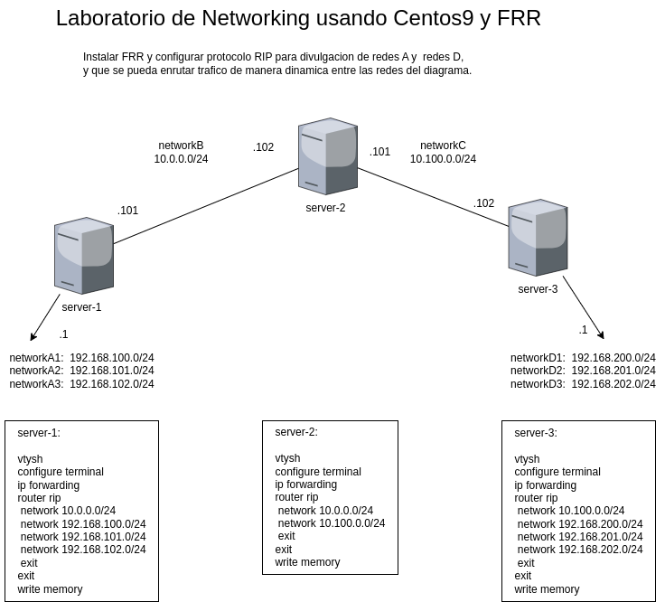

# Laboratorio de Networking usando Centos9 Stream y FRR


El objetivo de este laboratorio es configurar 3 VMs como routers instalando FRR y publicando sus rutas usando RIP en FRR.




## Requerimientos:
- Tener instalado [Virtualbox](https://www.virtualbox.org/wiki/Downloads)
- Tener instalado [Vagrant](https://developer.hashicorp.com/vagrant/install)

## Como usar
```sh
git clone https://github.com/adolfomaltez/vagrant-network-centos9.git
cd vagrant-network-centos9
vagrant up
```

# Configurar cada VM

## Configurar server-1
```sh
vagrant ssh server-1

sudo vtysh
configure terminal
ip forwarding
router rip
 network 10.0.0.0/24
 network 192.168.100.0/24
 network 192.168.101.0/24
 network 192.168.102.0/24
 exit
exit
write memory
```

## Configurar server-2
```sh
vagrant ssh server-2

sudo vtysh
configure terminal
ip forwarding
router rip
 network 10.0.0.0/24
 network 10.100.0.0/24
 exit
exit
write memory
```

## Configurar server-3
```sh
vagrant ssh server-3

sudo vtysh
configure terminal
ip forwarding
router rip
 network 10.100.0.0/24
 network 192.168.200.0/24
 network 192.168.201.0/24
 network 192.168.202.0/24
 exit
exit
write memory
```